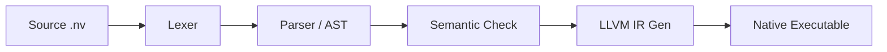

# 🚀 Nova DSL Compiler
> A High-Performance, Modular Compiler Pipeline Targeting LLVM IR


**Nova** is a custom statically-typed Domain-Specific Language (DSL) designed for systems programming. This repository implements a complete, end-to-end compiler built from scratch in C99, featuring a manual recursive-descent parser and a sophisticated code generation engine.

---

## ✨ Key Features
- **🎯 Full End-to-End Pipeline**: From raw source code to native `.exe` executables.
- **🧱 Modular Architecture**: Clean separation between Lexical Analysis, Parsing (AST), Semantic Analysis, and Code Generation.
- **💎 LLVM-Powered**: Generates standard LLVM Static IR, leveraging industry-leading optimizations.
- **🛡️ Built-in Portability**: Intelligent "C-Fallback" mechanism allows compilation even on systems without LLVM installed (targets MSVC/Clang/GCC).
- **📦 Advanced Types**: Native support for **Strings**, **Dynamic Arrays**, and **User I/O**.

---

## 🛠️ Compilation Pipeline

Your code travels through 5 professional compilation phases:



---

## 📂 Repository Structure

| Folder | Description |
| :--- | :--- |
| `src/` | **Core Engine**: Lexer, Parser, AST nodes, and Codegen. |
| `include/` | Public header definitions for compiler modularity. |
| `tests/` | Comprehensive test suite featuring recursion, sorting, and math. |
| `docs/` | Detailed academic reports and architecture specs. |
| `build/` | CMake build artifacts and generated binaries. |

---

## 🚀 Getting Started

### 1. Installation
Ensure you have **CMake** and a **C Compiler** (MSVC/GCC) installed.
```bash
mkdir build && cd build
cmake ..
cmake --build . --config Release
```

### 2. Compile Your First Program
Create a file `hello.nv`:
```c
fn main() -> int {
    print_string("Hello, Nova World!");
    return 0;
}
```

Compile it:
```bash
.\Release\novac.exe hello.nv -o hello.exe
```

---

## 📥 Sample: Bubble Sort with Strings
Nova is powerful enough to handle complex algorithms. Here is a snippet of a string-sorting program:

```c
fn main() -> int {
    let arr: string[] = allocate_string_array(3);
    arr[0] = "zebra";
    arr[1] = "apple";
    arr[2] = "monkey";
    
    // Automatic sorting call
    sort_strings(arr, 3);
    
    print_string(arr[0]); // Prints "apple"
    return 0;
}
```

---

## 👤 Author
**[Your Name Here]**  
*Register No: [Your Register No]*  
Course: Compiler Design  

---

## 📄 License
This project is licensed under the MIT License - see the [LICENSE](LICENSE) file for details.
